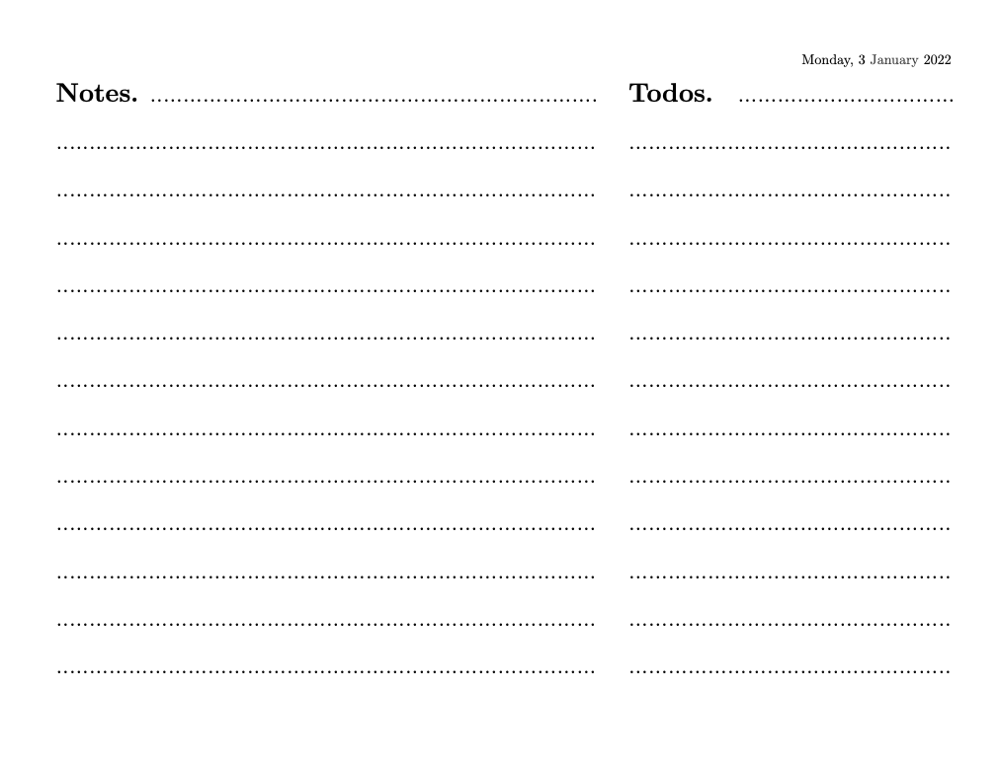

# reMarkable daily calendar

- Current version: `1.0.0 29dec2021`
- Jump to: [`overview`](#overview) [`construction`](#construction) [`update history`](#updatehistory) 

-----------

## Overview 

My simple-to-use pdf landscape calendar made for reMarkable; easily customize with some basic excel and latex skills. 

Simply load the 2022_dailycalendar.pdf on the reMarkable. 

*Features* 
- Landscape 
- Only workdays 
- Pre-filled dates
- Table of content: jump between months
- Links to monthly todos (click the month on the top right)

*Example month* 

*Example days* 

## Construction
- Adjust in excel: get all days-drop down, filter workdays-sheet, copy main sheet
- Copy into latex, adjust label (drop spaces) search  [MONTH] and replace  [\hyperref[MONTH]{MONTH}] (I plan to automate with for 2023)

## Update History
* **Dec 29, 2021** *
- initial commit
  

