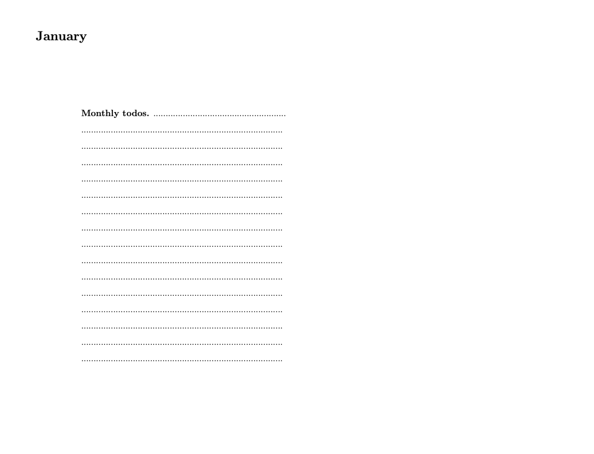

# reMarkable daily calendar

- Current version: `1.0.0 29dec2021`
- Jump to: [`overview`](#overview) [`construction`](#construction) [`update history`](#updatehistory) 

-----------

## Overview 

My simple-to-use landscape calendar made for reMarkable; easily customize with some basic excel and latex skills. 

*Features* 
- Landscape 
- Only work days 
- Pre-filed Dates 
- Links to monthly todos (click the month on the top right)
- Table of content: jump between months

*Construction*
- Adjust in excel: get all days-drop down, filter workdays-sheet, copy main sheet
- Copy into latex, adjust label (drop spaces) search ` MONTH ' and replace  `\hyperref[MONTH]{MONTH}' (plan to automate for 2023)

## Update History
* **Dec 29, 2021**
- initial commit
  

